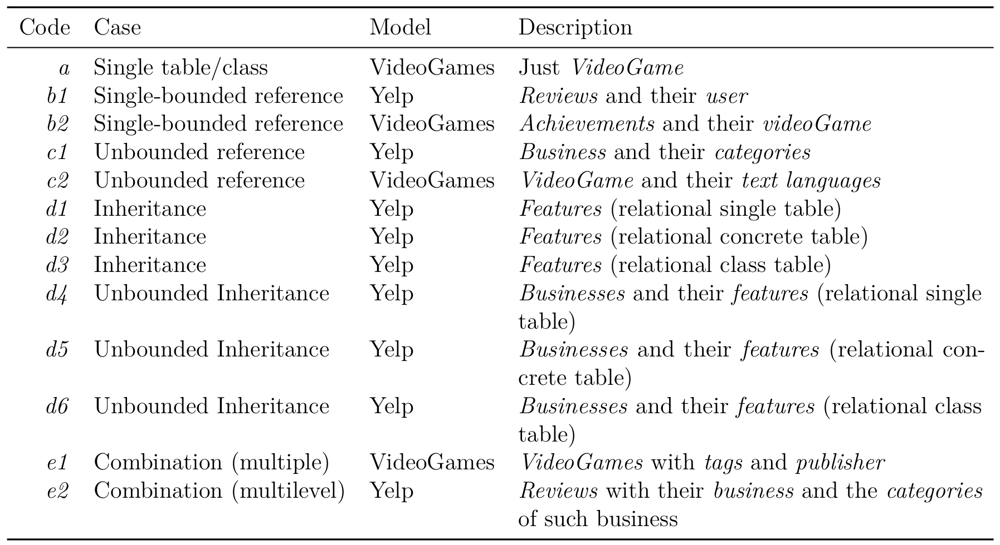

# Lavoisier Evaluation

This project contains a set of dataset specifications expressed in Lavoisier, SQL and Pandas.
The extraction scenarios are described in the "scenarios.png" picture, and are executed over the yelp and video games case studies.

## Dataset Extraction Scenarios

## Folder Structure

- *lavoisier* : Contains the dataset extractions for the Lavoisier language, one file per case study.
- *models* : Models and metamodels used in the Lavoisier's dataset specifications.
- *sql* : It contains two subfolders: "databases" contains different relational databases corresponding to the used inheritance reduction patterns and case studies. "queries" contains several .sql files with the dataset extractions for each case.
- *pandas* : Contains python scripts in notebook format with the extractions performed with the Pandas library. These extractions make use of the sql databases by connecting to them for the queries.
